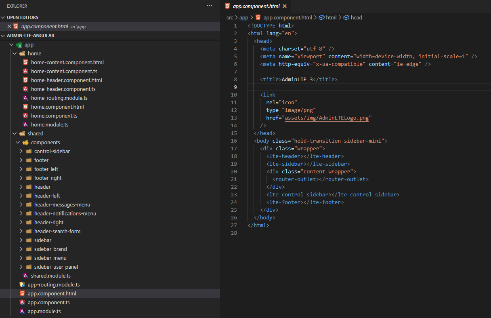
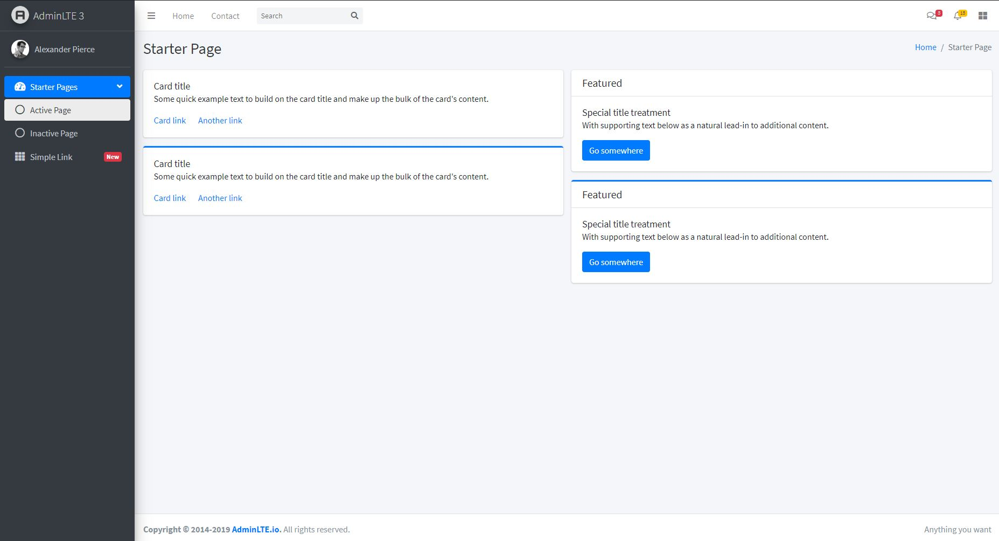

# admin-lte-angular

This repo shows how to implement layout and starter page of [AdminLTE v3](https://github.com/ColorlibHQ/AdminLTE) for Angular. I did layout implementation as modular as possible to control it better. I hope you guys can learn something from my approach.

#### Layout

#### Starter Page

